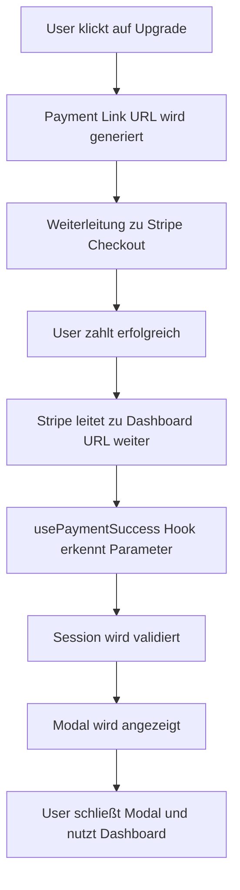

# Stripe Payment Links Konfiguration für Dashboard Modal

## Problem
Die aktuellen Payment Links zeigen auf `http://localhost:5173/payment/success`, was nur in der Entwicklung funktioniert. Für die Produktion und das Dashboard-Modal müssen die Success URLs angepasst werden.

## Lösung: Dashboard Modal Implementation

Das System wurde so implementiert, dass nach einer erfolgreichen Zahlung ein Modal im Dashboard angezeigt wird, anstatt auf eine separate Erfolgsseite weiterzuleiten.

### 1. Implementierte Komponenten

#### PaymentSuccessModal
- **Datei**: `src/components/ui/PaymentSuccessModal.tsx`
- **Funktion**: Zeigt ein Modal mit Erfolgsbestätigung und Plan-Details
- **Features**: 
  - Plan-spezifische Icons und Farben
  - Feature-Liste für den gekauften Plan
  - Bestätigungs-E-Mail-Anzeige
  - Benutzerfreundlicher "Weiter zum Dashboard" Button

#### usePaymentSuccess Hook
- **Datei**: `src/hooks/usePaymentSuccess.ts`
- **Funktion**: Erkennt Payment-Success-Parameter in der URL und validiert Sessions
- **Features**:
  - Automatische Session-Validierung über Stripe FDW
  - URL-Parameter-Bereinigung nach Verarbeitung
  - Plan-Type-Erkennung basierend auf Betrag
  - Error Handling

### 2. Integration in Dashboard-Seiten

Das Modal wurde in beide Dashboard-Seiten integriert:
- **OwnerDashboardPage**: `src/pages/OwnerDashboardPage.tsx`
- **CaretakerDashboardPage**: `src/pages/CaretakerDashboardPage.tsx`

### 3. Demo-Links für Entwicklung

In der Entwicklungsumgebung wurden Demo-Links hinzugefügt:
```
/dashboard-owner?payment_success=true&plan=premium&user_type=owner
/dashboard-caretaker?payment_success=true&plan=professional&user_type=caretaker
```

## Nächste Schritte: Stripe Payment Links aktualisieren

### Schritt 1: Payment Links in Stripe Dashboard bearbeiten

1. **Öffne das Stripe Dashboard**: https://dashboard.stripe.com/test/payments/links
2. **Bearbeite Owner Premium Payment Link**:
   - Link ID: `plink_1Ri8QfJixeonlF76qGmvldqG`
   - Aktuelle Success URL: `http://localhost:5173/payment/success`
   - **Neue Success URL**: `https://deine-domain.com/dashboard-owner?payment_success=true&plan=premium&user_type=owner`

3. **Bearbeite Caretaker Professional Payment Link**:
   - Link ID: Noch zu erstellen oder identifizieren
   - **Neue Success URL**: `https://deine-domain.com/dashboard-caretaker?payment_success=true&plan=professional&user_type=caretaker`

### Schritt 2: Domain-spezifische URLs

Für verschiedene Umgebungen:

#### Entwicklung (localhost):
```
http://localhost:5173/dashboard-owner?payment_success=true&plan=premium&user_type=owner
http://localhost:5173/dashboard-caretaker?payment_success=true&plan=professional&user_type=caretaker
```

#### Staging/Test:
```
https://staging.tigube.com/dashboard-owner?payment_success=true&plan=premium&user_type=owner
https://staging.tigube.com/dashboard-caretaker?payment_success=true&plan=professional&user_type=caretaker
```

#### Produktion:
```
https://tigube.com/dashboard-owner?payment_success=true&plan=premium&user_type=owner
https://tigube.com/dashboard-caretaker?payment_success=true&plan=professional&user_type=caretaker
```

### Schritt 3: Testing

1. **Lokales Testing**: Demo-Links in der SubscriptionCard verwenden
2. **Stripe Testing**: Mit echten Payment Links und Testmodus-Karten
3. **End-to-End Testing**: Vollständiger Checkout-Flow bis Modal

## Funktionsweise

### 1. Payment Flow


### 2. Parameter-Verarbeitung

Der `usePaymentSuccess` Hook sucht nach:
- `session_id`: Für echte Stripe Sessions
- `payment_success=true`: Fallback für URL-basierte Erfolgsanzeige
- `plan`: premium/professional
- `user_type`: owner/caretaker

### 3. Session-Validierung

```typescript
// Real payment mit Session ID
const result = await StripeService.validateCheckoutSession(sessionId);

// Plan-Type aus Betrag ermitteln
if (result.session.amount_total === 1290) { // €12.90
  planType = 'professional';
  userType = 'caretaker';
} else if (result.session.amount_total === 490) { // €4.90
  planType = 'premium';
  userType = 'owner';
}
```

## Vorteile dieser Lösung

1. **Bessere UX**: Benutzer bleibt im Dashboard anstatt auf separate Seite geleitet zu werden
2. **Flexibilität**: Funktioniert sowohl mit Session-IDs als auch URL-Parametern
3. **Responsive**: Modal passt sich an verschiedene Bildschirmgrößen an
4. **Informativ**: Zeigt spezifische Plan-Details und Features
5. **Nahtlose Integration**: Nutzer kann direkt weitermachen ohne zusätzliche Navigation

## Maintenance

- **Payment Link URLs**: Bei Domain-Änderungen in Stripe Dashboard aktualisieren
- **Plan-Preise**: Bei Preisänderungen die Betrags-Detection im Hook anpassen
- **Features**: Plan-Features in PaymentSuccessModal bei Änderungen aktualisieren 